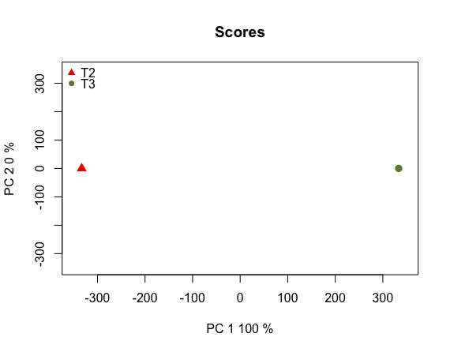

# RNA Sequence Analysis for Non Model Species Eastern larch (Tamarack)  
  
This repository is a usable, publicly available tutorial for analyzing differential expression data and creating topological gene networks. All steps have been provided for the UConn CBC Xanadu cluster here with appropriate headers for the Slurm scheduler that can be modified simply to run.  Commands should never be executed on the submit nodes of any HPC machine.  If working on the Xanadu cluster, you should use sbatch scriptname after modifying the script for each stage.  Basic editing of all scripts can be performed on the server with tools such as nano, vim, or emacs.  If you are new to Linux, please use [this](https://bioinformatics.uconn.edu/unix-basics) handy guide for the operating system commands.  In this guide, you will be working with common bio Informatic file formats, such as [FASTA](https://en.wikipedia.org/wiki/FASTA_format), [FASTQ](https://en.wikipedia.org/wiki/FASTQ_format), [SAM/BAM](https://en.wikipedia.org/wiki/SAM_(file_format)), and [GFF3/GTF](https://en.wikipedia.org/wiki/General_feature_format). You can learn even more about each file format [here](https://bioinformatics.uconn.edu/resources-and-events/tutorials/file-formats-tutorial/). If you do not have a Xanadu account and are an affiliate of UConn/UCHC, please apply for one **[here](https://bioinformatics.uconn.edu/contact-us/)**.  
  
Contents  
1. [Introduction](#1-introduction)  
2. [Quality Control](#2-quality-control)   
3. [Assembling the Transcriptome](#3-assembling-the-transcriptome)  
4. [Identifying the Coding Regions](#4-identifying-the-coding-regions)  
5. [Determining and Removing Redundent Transcripts](#5-determining-and-removing-redundent-transcripts)
6. [Creating An Index](#6-creating-an-index)
7. [Extraction of Read Counts using Kallisto](#7-extraction-of-read-counts-using-kallisto)
8. [Diffferential Expression](#8-differentially-expressed-genes)  
       a.    [Gfold](#a-differentially-expressed-genes-using-gfold)   
       b.    [NOISeq](#b-differentially-expressed-genes-using-noiseq) 
9. [EnTAP - Functional Annotation for DE Genes](#9-entap---functional-annotation-for-de-genes) 

 
 

## 1. Introduction  
  
In this tutorial we will be analyzing RNA-Sequence data from abscission zone tissue (between the needle and the stem) samples from the Eastern larch. The study is designed to examining the process of needle loss in Autumn. This data is not published and therefore can only be accessed through the Xanadu directory in "/UCHC/PublicShare/RNASeq_Workshop/Eastern_larch" We will be using the Eastern larch as a "non-model" organism.  
  
When an organism is called "model" there is an underlying assumption that very generous amounts of research have been performed on the species resulting in large pools of publicly available data. In biology and bioinformatics this means there are reference transcriptomes, structural annotations, known variant genotypes, and a wealth of other useful information in computational research. By contrast, when an organism is called "non-model" there is the underlying assumption that the information described prior will have to be generated by the research. This means that after extracting genetic data from a non-model organism, the researcher will then have to assemble the transcriptome, annotate the transcriptome, identify any pertinent genetic relationships, and so on. We can use this to develop a small map of our goals for analyzing our Eastern larch RNA samples. That is:  

  

The data consists of 4 libraries under two different time points (roughly one month apart). This is representing 3 tree for two populations (U and K).  
*  U32 : UConn Tree 3, at time point 2  
*  U13 : UConn Tree 1, at time point 3  
*  K32 : Killingworth Tree 2, at time point 2   
*  K23 : Killingworth Tree 2, at time point 3

  
  
In this workflow we have seperated each step into folders, where you can find the appropriate scripts in conjunction with each steps. When you clone the git repository, the below directory structure will be cloned into your working directory.   

So to follow the steps would be esay once you have cloned this git repository using the `clone` command:
```
git clone < git-repository.git >

```

Once you clone the repository you can see the following folder structure:  

```  
Eastern_larch/
├── Raw_Reads
├── Quality_Control
├── Assembly
├── Coding_Regions
├── Clustering
├── Index
├── Counts
├── Gfold
└── EnTAP
```  
   
   
The tutorial will be using SLURM schedular to submit jobs to Xanadu cluster. In each script we will be using it will contain a header section which will allocate the resources for the SLURM schedular. The header section will contain:  

```bash
#!/bin/bash
#SBATCH --job-name=JOBNAME
#SBATCH -n 1
#SBATCH -N 1
#SBATCH -c 1
#SBATCH --mem=1G
#SBATCH --partition=general
#SBATCH --qos=general
#SBATCH --mail-type=ALL
#SBATCH --mail-user=first.last@uconn.edu
#SBATCH -o %x_%j.out
#SBATCH -e %x_%j.err
```  

Before beginning, we need to understand a few aspects of the Xanadu server. When first logging into Xanadu from your local terminal, you will be connected to the submit node. The submit node is the interface with which users on Xanadu may submit their processes to the desired compute nodes, which will run the process. Never, under any circumstance, run processes directly in the submit node. Your process will be killed and all of your work lost! This tutorial will not teach you shell script configuration to submit your tasks on Xanadu. Therefore, before moving on, read and master the topics covered in the [Xanadu tutorial](https://bioinformatics.uconn.edu/resources-and-events/tutorials-2/xanadu/).  
  
### Linking the Raw Reads data  

These data files are only avaliable through Xanadu cluster, as they belong to the Dr. Jill Wegrzyn lab. If you are working in the Xanadu cluster to avoid redundancy in the data files, you can create a simlink to the read files. After creating sim-links you can work your way though the rest of the steps as we have discussed in the tutorial. 

So in the **Raw_Reads** folder we have created a script to creat a sim-links for the actual data, which is called [raw_data_simlinks.sh](/Raw_Reads/raw_data_simlinks.sh), You can run this script using `sbatch` command.  
 
  
Raw_Reads folder will look like:  
```
Raw_Reads/
├── K23
│   ├── K23_R1.fastq
│   └── K23_R2.fastq
├── K32
│   ├── K32_R1.fastq
│   └── K32_R2.fastq
├── U13
│   ├── U13_R1.fastq
│   └── U13_R2.fastq
└── U32
    ├── U32_R1.fastq
    └── U32_R2.fastq 
```
   
### Familiarizing yourself with the raw reads

The reads with which we will be working have been sequenced using [Illumina](https://www.illumina.com/techniques/sequencing.html). We assume that you are familiar with the sequencing technology. Let's have a look at the content of one of our reads, which are in the "fastq" format:

```bash
head -n 4 K32_R1.fastq
```

which will show the first four lines in the fastq file:

```
@NS500402:381:HH3NFBGX9:1:11101:2166:1038 1:N:0:CGCTCATT+AGGCTATA
AGAACTCGAAACTAAACGTGGACGTGNTNNTATAAACNNANACNAATCCATCGCCGGTTNNCNTATNNNNNNNNNN
+
AAAAAEEEEEEEEEEEEEEEEEEEEE#E##EEEEEEE##E#EE#EEEE6EEEEEEEEEE##A#EAE##########
```

In here we see that first line corrosponds to the sample information followed by the length of the read, and in the second line corrosponds to the nucleotide reads, followed by the "+" sign where if repeats the information in the first line. Then the fourth line corrosponds to the quality score for each nucleotide in the first line.   
   
   
## 2. Quality Control

### Quality control of Illumina reads using Sickle
Step one is to perform quality control on the reads, and we will be using Sickle for the Illumina reads. To start with we have paired-end reads.  

```bash
module load sickle/1.33

sickle pe -f ../Raw_Reads/U13/U13_R1.fastq \
        -r ../Raw_Reads/U13/U13_R2.fastq \
        -t sanger \
        -o trim_U13_R1.fastq \
        -p trim_U13_R2.fastq \
        -s singles_U13.fastq \
        -q 30 -l 45

sickle pe -f ../Raw_Reads/U32/U32_R1.fastq \
        -r ../Raw_Reads/U32/U32_R2.fastq \
        -t sanger \
        -o trim_U32_R1.fastq \
        -p trim_U32_R2.fastq \
        -s singles_U32.fastq \
        -q 30 -l 45

sickle pe -f ../Raw_Reads/K32/K32_R1.fastq \
        -r ../Raw_Reads/K32/K32_R2.fastq \
        -t sanger \
        -o trim_K32_R1.fastq \
        -p trim_K32_R2.fastq \
        -s singles_K32.fastq \
        -q 30 -l 45

sickle pe -f ../Raw_Reads/K23/K23_R1.fastq \
        -r ../Raw_Reads/K23/K23_R2.fastq \
        -t sanger \
        -o trim_K23_R1.fastq \
        -p trim_K23_R2.fastq \
        -s singles_K23.fastq \
        -q 30 -l 45
```
   
The useage information on the sickle program:  
```
Usage: sickle pe [options] -f <paired-end forward fastq file> 
	-r <paired-end reverse fastq file> 
	-t <quality type> 
	-o <trimmed PE forward file> 
	-p <trimmed PE reverse file> 
	-s <trimmed singles file>    

Options:
-f, --pe-file1, Input paired-end forward fastq file
-r, --pe-file2, Input paired-end reverse fastq file
-o, --output-pe1, Output trimmed forward fastq file
-p, --output-pe2, Output trimmed reverse fastq file
-s                Singles files

Global options:
-t, --qual-type, Type of quality values
                solexa (CASAVA < 1.3)
                illumina (CASAVA 1.3 to 1.7)
                sanger (which is CASAVA >= 1.8)
-s, --output-single, Output trimmed singles fastq file
-l, --length-threshold, Threshold to keep a read based on length after trimming. Default 20
-q, --qual-threshold, Threshold for trimming based on average quality in a window. Default 20
```  
   
The quality may be any score from 0 to 40. The default of 20 is much too low for a robust analysis. We want to select only reads with a quality of 30 or better. Additionally, the desired length of each read is 35bp. Again, we see that a default of 20 is much too low for analysis confidence. Lastly, we must know the scoring type. While the quality type is not listed on the SRA pages, most SRA reads use the "sanger" quality type. Unless explicitly stated, try running sickle using the sanger qualities. If an error is returned, try illumina. If another error is returned, lastly try solexa.  

The full slurm script which is called [sickle.sh](/Quality_Control/sickle.sh) is stored in the Quality_Control folder.  

At the end of the run, each run will produce **3** files, a trimmed forward read file, trimmed reverse read file and a singles file. Singles file will contain the reads which did not have a paired read to start with. The following files will be produced at the end of the run:  
```
Quality_Control/
├── trim_U13_R1.fastq
├── trim_U13_R2.fastq
├── singles_U13.fastq
├── trim_U32_R1.fastq
├── trim_U32_R2.fastq
├── singles_U32.fastq
├── trim_K23_R1.fastq
├── trim_K23_R2.fastq
├── singles_K23.fastq
├── trim_K32_R1.fastq
├── trim_K32_R2.fastq
└── singles_K32.fastq
```
  
The summary of the reads will be in the `*.out` file, which will give how many reads is kept and how many have been discarded in each run.  
  
| Sample | Input records | Paired records kept | single records kept | paired records discarded | single records discarded | Kept (%) |   
| --- | --- | --- | --- | --- | --- | --- |   
| U13 | 36516384 | 36516384 | 4048114 | 4004868 | 4048114 | 75.1 |   
| U32 | 46566276 | 35981128 | 3388161 | 3808826 | 3388161 | 77.3 |   
| K32 | 41656220 | 30657748 | 3646736 | 3705000 | 3646736 | 73.6 |     
| K23 | 45017196 | 33692758 | 3669578 | 3985282 | 3669578 | 74.2 |   
   
   
   
       
## 3. Assembling the Transcriptome   
    
### De novo Assembling the Transcriptome using Trinity   
   
Now that we've performed quality control we are ready to assemble our transcriptome using the RNA-Seq reads. We will be using the software [Trinity](https://github.com/trinityrnaseq/trinityrnaseq/wiki). Nearly all transcriptome assembly software operates under the same premise. Consider the following:

Suppose we have the following reads:
```
A C G A C G T T T G A G A
T T G A G A T T A C C T A G
```

We notice that the end of each read is the beginning of the next read, so we assemble them as one sequence by matching the overlaps:
```
A C G A C G T T T G A G A
              T T G A G A T T A C C T A G
```

Which gives us:
```
A C G A C G T [T T G A G A] T T A C C T A G
```

    
### De novo Assembling the Transcriptome using Trinity

In De novo assembly section, we will be woking in the `assembly` directory. In here we will be assembling the trimmed illumina reads seperatly using the trinity transcriptome assembler. Assembly requires a great deal of memory (RAM) and can take few days if the read set is large. Following is the trinity command that we use to assemble each transcriptome seperatly.    
   
```bash
module load trinity/2.6.6

Trinity --seqType fq \
        --left ../Quality_Control/trim_U13_R1.fastq \
        --right ../Quality_Control/trim_U13_R2.fastq \
        --min_contig_length 300 \
        --CPU 36 \
        --max_memory 100G \
        --output trinity_U13 \
        --full_cleanup 

Trinity --seqType fq \
        --left ../Quality_Control/trim_U32_R1.fastq \
        --right ../Quality_Control/trim_U32_R2.fastq \
        --min_contig_length 300 \
        --CPU 36 \
        --max_memory 100G \
        --output trinity_U32 \
        --full_cleanup

Trinity --seqType fq \
        --left ../Quality_Control/trim_K32_R1.fastq \
        --right ../Quality_Control/trim_K32_R2.fastq \
        --min_contig_length 300 \
        --CPU 36 \
        --max_memory 100G \
        --output trinity_K32 \
        --full_cleanup

Trinity --seqType fq \
        --left ../Quality_Control/trim_K23_R1.fastq \
        --right ../Quality_Control/trim_K23_R2.fastq \
        --min_contig_length 300 \
        --CPU 36 \
        --max_memory 100G \
        --output trinity_K23 \
        --full_cleanup
```  
    
    
So the useage information for Trinity program we use:
```
Usage:  Trinity [options]

Options (Required):
--seqType <string>       : type of reads: ('fa' or 'fq')
--max_memory <string>    : max memory to use by Trinity

if unpaired reads
--single <string>        : unpaired/single reads, one or more file names can be included

if paired reads
--left  <string>         :left reads, one or more file names (separated by commas, no spaces)
--right <string>         :right reads, one or more file names (separated by commas, no spaces) 

Options (optional)
--CPU <int>              : number of CPUs to use, default: 2
--min_contig_length <int>: minimum assembled contig length to report (def=200)
--output <string>        : directory for output
--full_cleanup           : only retain the Trinity fasta file, rename as ${output_dir}.Trinity.fasta
```  
   
     
The full slurm script is called [Trinity.sh](/Assembly/Trinity.sh), and can be found in the assembly directory.   

Trinity combines three independent software modules: Inchworm, Chrysalis, and Butterfly, applied sequentially to process large volumes of RNA-seq reads. Trinity partitions the sequence data into many individual de Bruijn graphs, each representing the transcriptional complexity at a given gene or locus, and then processes each graph independently to extract full-length splicing isoforms and to tease apart transcripts derived from paralogous genes. Briefly, the process works like so:   
    
_Inchworm_ assembles the RNA-seq data into the unique sequences of transcripts, often generating full-length transcripts for a dominant isoform, but then reports just the unique portions of alternatively spliced transcripts.   
   
_Chrysalis_ clusters the Inchworm contigs into clusters and constructs complete de Bruijn graphs for each cluster. Each cluster represents the full transcriptonal complexity for a given gene (or sets of genes that share sequences in common). Chrysalis then partitions the full read set among these disjoint graphs.   
    
_Butterfly_ then processes the individual graphs in parallel, tracing the paths that reads and pairs of reads take within the graph, ultimately reporting full-length transcripts for alternatively spliced isoforms, and teasing apart transcripts that corresponds to paralogous genes.   
   
During the **Trinity** run there will be lots of files will be grenerated. These checkpoint files will help us to restart from that specific point if for some reason the program stops for some other problems. Once the program ends sucessfully all these checkpoint files will be removed since we have requested a full cleanup using the `--full_cleanup` command. Clearing the files is very important as it will help us to remove all the unwanted files and also to keep the storage capacity and the number of files to a minimum. So at the end of a successful run we will end up with the following files:   
   
```
Assembly/
├── trinity_K23.Trinity.fasta
├── trinity_K23.Trinity.fasta.gene_trans_map
├── trinity_K32.Trinity.fasta
├── trinity_K32.Trinity.fasta.gene_trans_map
├── trinity_U13.Trinity.fasta
├── trinity_U13.Trinity.fasta.gene_trans_map
├── trinity_U32.Trinity.fasta
└── trinity_U32.Trinity.fasta.gene_trans_map
```
   
So we will have three assembly files, one for each condition or time step.  
  
   
     
     
## 4. Identifying the Coding Regions   
   
### Identifying coding regions using TransDecoder   

Now we have our assembled transcriptomes for the each of the libraries. Before looking for the coding regions we will combine all the assemblies together. We will be working in the `Coding_Regions` directory, and for this we will use the UNIX command `cat` as follows:  

```bash
cat ../Assembly/trinity_U13.Trinity.fasta \
	../Assembly/trinity_U32.Trinity.fasta \
	../Assembly/trinity_K32.Trinity.fasta \
	../Assembly/trinity_K23.Trinity.fasta >> ../Assembly/trinity_combine.fasta
``` 

Now that we have our reads assembled and combined together into the single file, we can use [TransDecoder](https://github.com/TransDecoder/TransDecoder/wiki) to determine optimal open reading frames from the assembly (ORFs). Assembled RNA-Seq transcripts may have 5′ or 3′ UTR sequence attached and this can make it difficult to determine the CDS in non-model species. We will not be going into how TransDecoder works. However, should you click the link you'll be happy to see that they have a very simple one paragraph explanation telling you exactly that.
Our first step is to determine all [open-reading-frames](https://en.wikipedia.org/wiki/Open_reading_frame). We can do this using the 'TransDecoder.LongOrfs' command. This command is quite simple, with one option, '-t', which is simply our centroid fasta! The command is therefore:   
   
```
module load TransDecoder/5.3.0

TransDecoder.LongOrfs -t ../Assembly/trinity_combine.fasta
```

The command useage would be:
```
Transdecoder.LongOrfs [options]

Required:
  -t <string>           transcripts.fasta
```


By default it will identify ORFs that are at least 100 amino acids long. (you can change this by using -m parameter). It will produce a folder called centroids.fasta.transdecoder_dir   

```
coding_regions
├── trinity_combine.fasta.transdecoder_dir
│   ├── base_freqs.dat
│   ├── longest_orfs.cds
│   ├── longest_orfs.gff3
│   └── longest_orfs.pep
```


Next step is to, identify ORFs with homology to known proteins via blast or pfam searches. This will maximize the sensitivity for capturing the ORFs that have functional significance. We will be using the Pfram databases. Pfam stands for "Protein families", and is simply an absolutely massive database with mountains of searchable information on, well, you guessed it, protein families. We can scan the Pfam databases using the software hmmer, a database homologous-sequence fetcher. The Pfam databases are much too large to install on a local computer. However, you may find them on Xanadu in the directory '/isg/shared/databases/Pfam/Pfam-A.hmm', which is an hmmer file (must be an hmmer file for hmmer to scan!).  
   
```
hmmscan --cpu 16 \
        --domtblout pfam.domtblout \
        /isg/shared/databases/Pfam/Pfam-A.hmm \
        trinity_combine.fasta.transdecoder_dir/longest_orfs.pep
```

Usage of the command:
```
Usage: hmmscan [-options] <hmmdb> <seqfile>

Options controlling output:
--domtblout <f>  : save parseable table of per-domain hits to file <f>

Other expert options:
--cpu <n>     : number of parallel CPU workers to use for multithreads  [2]
```

It is absolutely vital that you place these arguments in the order in which they appear above. You do not want 'hmmscan' thinking your centroids are your database and your database are your centroids!    


Once the run is completed it will create the following files in the directory.

```
coding_regions
├── pfam.domtblout
```
    
Lastly we use the 'TransDecoder.Predict' function to predict the coding regions we should expect in our transcriptome using the output from hmmscan (the pfam.domtblout file).   
   
```bash
TransDecoder.Predict -t ../Assembly/trinity_combine.fasta \
        --retain_pfam_hits pfam.domtblout \
        --cpu 16
```   
   
Usage of the command:   
```
Transdecoder.LongOrfs

Required:
-t <string>        : transcripts.fasta

Common options:
--retain_pfam_hits : domain table output file from running hmmscan to search Pfam (see transdecoder.github.io for info)
```   
   
This will add output to our `trinity_combine.fasta.transdecoder_dir`, which now looks like:
```
Coding_Regions/
├── pfam.domtblout
├── pipeliner.38689.cmds
├── pipeliner.5719.cmds
├── pipeliner.63894.cmds
├── trinity_combine.fasta.transdecoder.bed
├── trinity_combine.fasta.transdecoder.cds
├── trinity_combine.fasta.transdecoder_dir/
│   ├── base_freqs.dat
│   ├── hexamer.scores
│   ├── longest_orfs.cds
│   ├── longest_orfs.cds.best_candidates.gff3
│   ├── longest_orfs.cds.best_candidates.gff3.revised_starts.gff3
│   ├── longest_orfs.cds.scores
│   ├── longest_orfs.cds.top_500_longest
│   ├── longest_orfs.cds.top_longest_5000
│   ├── longest_orfs.cds.top_longest_5000.nr
│   ├── longest_orfs.gff3
│   └── longest_orfs.pep
├── trinity_combine.fasta.transdecoder.gff3
└── trinity_combine.fasta.transdecoder.pep
```

The full script is called [transdecoder.sh](/Coding_Regions/transdecoder.sh), which is located in the `Coding_Regions` directory.    
In the next step we will be using the *trinity_combine.fasta.transdecoder.cds* fasta file for creating consensus sequence.   
   
     
    

## 5. Determining and Removing Redundent Transcripts

### Clustering using vsearch
Because we used RNA reads to sequence our transcriptome, chances are that there are multiples of the same reads varying slightly which create multiples of the same assembled sequence. Under this assumption, we may also assume that most of the modules in our assembled transcriptome are actually repeats, the results of the assembly of slightly different reads from the same gene. We want to remove the repeats of these modules to shorten the length of our transcriptome and make for more efficient work in the future. We can do this by partitioning and clustering the transcriptome, then taking only one module from each of the clusters. There is a very convenient software which performs all of this for us in the exact way just described: [vsearch](https://github.com/torognes/vsearch).

To obtain a set of unique genes from both runs, we will cluster the two resulting assemblies together. First, the two assembies will be combined into one file using the Unix command cat, which refers to concatanate.

Since we have selected our reads according to the coding regions in the previous step, we will use vsearch to find redundancy between the assembled transcripts and create a single output known as a centroids file. The threshold for clustering in this example is set to 80% identity. In this step we will be working in the **Clustering** directory:   
 
```bash
module load vsearch/2.4.3

vsearch --threads 8 --log LOGFile \
        --cluster_fast ../Coding_Regions/trinity_combine.fasta.transdecoder.cds \
        --id 0.90 \
        --centroids centroids.fasta \
        --uc clusters.uc

```

Command options in the vsearch program that we used:
```
Usage: vsearch [OPTIONS]
--threads INT               number of threads to use, zero for all cores (0)
--log FILENAME              write messages, timing and memory info to file
--cluster_fast FILENAME     cluster sequences after sorting by length
--id REAL                   reject if identity lower, accepted values: 0-1.0
--centroids FILENAME        output centroid sequences to FASTA file
--uc FILENAME               specify filename for UCLUST-like output
```

The full script is called [vsearch.sh](/Clustering/vsearch.sh), which can be found in the **Clustering** folder. At the end of the run it will produce the following files:
```
Clustering/
├── centroids.fasta
├── clusters.uc
├── combine.fasta
└── LOGFile
```

The _centroids.fasta_ will contain the unique genes from the four assemblies. 
    
     
     
## 6. Creating An Index   

### Creating an index using Kallisto   

In this step we will be working in the *index* directory. Before aligning the reads we need to create a index for the created transcoder assembly. We will be using [Kallisto](https://pachterlab.github.io/kallisto/)  to build the index using the following command:

```bash
module load kallisto/0.44.0

kallisto index -i Eastern_larch_index ../Clustering/centroids.fasta
```   
    
Arguments used for creating the index file:
```
Usage: kallisto index [arguments] FASTA-files


Required argument:
-i, --index=STRING          Filename for the kallisto index to be constructed

```  
    
The full slurm script is called [kallisto_index.sh](/Index/kallisto_index.sh) can be found in the **Index** folder. This will create a kallisto index of the *centroids.fasta* FASTA file, where it will create the following file:   
```
Index/
└── Eastern_larch_index
```
    
   
    
## 7. Extraction of Read Counts using Kallisto
     

In this step we will be working in **Counts** directory, and will be using the the `kallisto quant` command to run the quantification algorithm. As for this tutorial moving forward we will only going to do a pairwise comparison for tutorials time constrans, so we are only doing to compare time points 2 and 3 using the Killingworth tree here.  
 

```bash
module load kallisto/0.44.0

kallisto quant -i ../Kallisto_Index/Eastern_larch_index \
        -o K23 \
        -t 8 \
        ../Quality_Control/trim_K23_R1.fastq ../Quality_Control/trim_K23_R2.fastq

kallisto quant -i ../Kallisto_Index/Eastern_larch_index \
        -o K32 \
        -t 8 \
        ../Quality_Control/trim_K32_R1.fastq ../Quality_Control/trim_K32_R2.fastq

``` 
    
Usage information of the `kallisto quant`:
```
Usage: kallisto quant [arguments] FASTQ-files

Required arguments:
-i, --index=STRING            	Filename for the kallisto index to be used for quantification
-o, --output-dir=STRING       Directory to write output to

Optional arguments:
-t, --threads=INT             Number of threads to use (default: 1)
```   
   
    
**kallisto** can process either paired-end or single-end reads. The default running mode is paired-end reads and need a even number of FASTQ files, for represent the pairs as shown in above example. When running single end reads please check the [kallisto manual](https://pachterlab.github.io/kallisto/manual) for correct parameters. The complete slurm script is called [kallisto_counts.sh](/Counts/kallisto_counts.sh) which is stored in the **Counts** directory.  
  

By running the quantification algorithum it will produce three output files: 
 *  abundance.h5  : HDF5 binary file   
	It contains run information, abundance estimates, bootstrap estimates and transcript lenght information
 *  abundance.tsv : plaintext file of the abundance estimates  
	This contains effective length, estimated counts and TPM values  
 *  run_info.json : information on the run  
  
   
When you run the above kallisto quantification algorithm, it will produce the following output:  
```
Counts/
├── K23/
│   ├── abundance.h5
│   ├── abundance.tsv
│   └── run_info.json
└── K32/
    ├── abundance.h5
    ├── abundance.tsv
    └── run_info.json
```

Now if you look at the first few lines in the _abundance.tsv_ file using the `head` command. We can see that, it has five columns which are _geneID_, _gene length_, _effective gene length_, _estimated counts_ and _tpm_ values.  

```
target_id	length	eff_length	est_counts	tpm
TRINITY_DN27913_c0_g1_i1.p3	13230	13072.3	172	0.861807
TRINITY_DN27054_c1_g6_i1.p1	11508	11350.3	183.401	1.05834
TRINITY_DN26839_c0_g2_i1.p1	10935	10777.3	16.3293	0.099241
TRINITY_DN21012_c2_g1_i3.p1	10839	10681.3	172	1.05472
```


## 8. Differentially Expressed Genes 

In this section we will show you two methods of finding the differentially expressed genes namely **Gfold** and **NOISeq**.  

### a. Differentially Expressed Genes using Gfold   

   
In here we are trying to get the differentially expressed genes between two conditions. In such situations where there is no replicates avaliable [Gfold](https://zhanglab.tongji.edu.cn/softwares/GFOLD/index.html) is very useful. Gfold program will generalizes the fold change by cosidering the posterior distribution of log fold change, such that it is assigned a reliable fold change. Gfold overcomes the shortcommings of p-value and read counts with low read counts.   
 
In order to get fold change using Gfold program, you need to provide a count file in a perticular format. For the Gfold program the count file should contain 5 columns, where it should contain _GeneSymbol_, _GeneName_, _Read Count_, _Gene exon length_ and _RPKM_. In this input most important columns are _Gene Symbol_ and _Read Count_ information.   
  
We will use the kallisto generated _abundance.tsv_ file and reformat it, so it will contain the fields which Gfold program needs as its input. For reformating you can use any programing language that you like. But in here we will be using `awk` to manipulate these columns. AWK is a very powefull language which allows you to get usefull infomation.  
   
```awk
awk '{print $1 "\t" $1 "\t" $4 "\t" $2 "\t" $5 }' ../Counts/K23/abundance.tsv > K23.read_cnt
awk '{print $1 "\t" $1 "\t" $4 "\t" $2 "\t" $5 }' ../Counts/K32/abundance.tsv > K32.read_cnt
```  

You can run this command in a interative session or can run the [count2gfoldCounts.sh](/Gfold/count2gfoldCounts.sh) script using shell in a interative session. 
```bash
sh count2gfoldCounts.sh
```  

This will produce counts files which are in Gfold format.  
```
Gfold/
├── K23.read_cnt
└── K32.read_cnt
```   
   
Gfold program does not take the header row so either you have to delete the first row or comment out the header before you run the progra
m. Now if you look at any of these files it will now contain five columns as follows:
```
TRINITY_DN27913_c0_g1_i1.p3	TRINITY_DN27913_c0_g1_i1.p3	3561	13230	12.3338
TRINITY_DN27054_c1_g6_i1.p1	TRINITY_DN27054_c1_g6_i1.p1	3895.81	11508	15.5417
TRINITY_DN26839_c0_g2_i1.p1	TRINITY_DN26839_c0_g2_i1.p1	1220.95	10935	5.12987
TRINITY_DN21012_c2_g1_i3.p1	TRINITY_DN21012_c2_g1_i3.p1	3349	10839	14.1975
TRINITY_DN17708_c0_g1_i3.p1	TRINITY_DN17708_c0_g1_i3.p1	967	9297	4.79158
```

### Using Gfold the get differentially expressed genes  

Now since we have the counts files in the correct format, we will run the Gfold using the following command. We will be using the K23.read_cnt and K32.read_cnt as input files.
```bash
module load gfold/1.1.4

gfold diff -s1 K32 -s2 K23 -suf .read_cnt -o K32_vs_K23.diff
``` 

Usage information of the gfold:
```
gfold diff [options]

-s1      sample-1
-s2      sample-2
-o	 output file name
-suf	 input files extention
```
   
The complete slurm script is called [gfold.sh](/Gfold/gfold.sh) which is stored in the **Gfold** directory. By running the Gfold program it will generate the following files, which contains the fold change value between the two conditions.
```
Gfold/
├── K32_vs_K23.diff
└── K32_vs_K23.diff.ext
```   
   
Gfold value can be considered as a log2-fold change value, where possitive/negative value will indicate its up/down regulated. First few lines in the *K32_vs_K23.diff* will be like:  

```
#GeneSymbol     GeneName        GFOLD(0.01)     E-FDR   log2fdc 1stRPKM 2ndRPKM
TRINITY_DN27913_c0_g1_i1.p3     TRINITY_DN27913_c0_g1_i1.p3     2.49054 1       2.74244 2.33862 22.549
TRINITY_DN27054_c1_g6_i1.p1     TRINITY_DN27054_c1_g6_i1.p1     2.53847 1       2.78281 2.8605  28.3545
TRINITY_DN26839_c0_g2_i1.p1     TRINITY_DN26839_c0_g2_i1.p1     3.81393 1       4.54498 0.263204        9.34665
TRINITY_DN21012_c2_g1_i3.p1     TRINITY_DN21012_c2_g1_i3.p1     2.4016  1       2.65392 2.8545  25.8846
TRINITY_DN17708_c0_g1_i3.p1     TRINITY_DN17708_c0_g1_i3.p1     2.27485 1       2.74287 0.890033        8.71362
```  


### b. Differentially Expressed Genes using NOISeq  

Another program which is usefull in finding differentially expressed genes when there are no replicates is [NOISeq](https://bioconductor.org/packages/release/bioc/html/NOISeq.html) which is a R backage. It can be use to get explortory plots to evaluate count distribution, types of detected features, and differential expression between two conditions.   
  
In order to get the expressed genes using NOISeq program, you need to provide the count files as the input. For that we will use the kallisto generated count files which can be found in *abundance.tsv* files generated for each sample in the indexing step. As the abundance.tsv file will contain _GeneSymbol, GeneName, Read Count, Gene exon length and RPKM_ and we will use a *awk* command to grab only the _GeneSymbol_ and _Read Count_ from the *abundance.tsv* file.  

```
awk '{print $1 "\t" $4}' ../Counts/K23/abundance.tsv > K23.counts
awk '{print $1 "\t" $4}' ../Counts/K32/abundance.tsv > K32.counts
```   

You can run this command in a interative session or can run the [counts.sh](/NOISeq/counts.sh) script using shell in a interative session.   
  
```bash
sh counts.sh
```   

This will produce counts files with two columns where it will contain the Gene Name and the counts associated with it.   

```
NOISeq/
├── K23.counts
└── K32.counts
```   

  
### NOISeq to produce differnetially expressed genes   

This part can be run using the cluster or using your own PC or laptop. We do recommend transfering the above counts files to your own computer and run using RStudio package.  

*Prerequiests* Before using the NOISeq package you need to make sure you have already downloaded the required packages including NOISeq and dplyr packages. If not please download the necessary packages which is compatible with your version of R included in the RStudio/R.  

When running the R code discribed below will assume you have downloaded the count files to your R working directory.   

We will load the the *dplyr* library and will set the paths to the input count files and output files which will be generated during the execution of the program. The following script will produce csv files and image files to the current directory, if you would like to direct it to a different location you are welcome to do so be changing the path of the output.  

```r
library(dplyr)

list.files()

#Set directory paths to working directory
count_dir <- getwd()
csv_out <- getwd()
image_out <- getwd()
```   

Next we will create a dataframe to hold the count files by reading one at a time.  
```r
##  Read count files AND creating a dataframe to hold the count data

#create a empty dataframe called m to merge the data into
m = data.frame()
# using for loop read all the count files in the count_dir path
for (i in list.files(pattern = ".counts")) {
  print(paste0("reading file: ", i))
  #read file as a data frame
  
  f <- read.table(i, sep = "\t", header = TRUE)
  #rename the columns
  colnames(f) <- c("gene_id", substr(i, 1, nchar(i)-7))
  #copy the data to another dataframe called f1
  f1 <- subset(f, select= c("gene_id", substr(i, 1, nchar(i)-7)))
  
  #if the m is empty just copy the f to m
  if(length(m) == 0){
    m = f1
    
  } else 
  {
    #if the dataframe is not empty then merge the data
    m <- merge(m, f1, by.x = "gene_id", by.y = "gene_id")
  }
  rm(f1)
}

#grab the rows from the 1st colum and use it as the row-names in the dataframe
rownames(m) <- m[,1]

# remove the column-1 (gene_ids) from the data frame using dplyr::select function
m <- select(m, "K23", "K32")
```   

Once the dataframe is created each column is represented by a sample and the rows with feature counts.  
 
Next we will prepare the meta data for the analysis. In here we can include the samples and different conditions we are hoping the evaluate. For this experiment we have two time points of data from a same location we will include that using TimePoint as a condition, which we would like to evaluate.   

```r
#################################################
## MetaData
#################################################
Sample = c("K32", "K23")
Condition = c("Killingworth", "Killingworth")
TimePoint = c("T2", "T3")
myfactors <- data.frame(Sample, Condition, TimePoint)
myfactors
```   

Once the myfactors dataframe is created it is important to check the columns in the dataframe(m) and mata-data rows are in the the same order.  

```r
# first check wheter all the columns in dataframe(m) and myfactor is present
all(colnames(m) %in% myfactors$Sample)

# Then check the order is correct
all(rownames(m) == myfactors$Sample[1])

# Then order them according to the Sample names
m <- m[, myfactors$Sample]

# Now check the order is correct after sorting 
all(colnames(m) == myfactors$Sample)
```   

As the next step we will create the NOISeq object using the count dataframe and factors dataframe created above.  

```r
#####################################################
##  NOISeq          
#####################################################

library(NOISeq)

# Creating a NOISeq object
mydata <- readData(data = m, factors = myfactors)
mydata

head(assayData(mydata)$exprs)
head(pData(mydata))
```   

####  PCA Plots 
Principle component analysis plots can be obtained using the package. Before generating anytype of plots, *dat* function must be applied on the input data which is the NOISeq object to obtain the data which is needed. This can be passed using the _type_ argument. Once the data is generated to plot, image can be generated using the _explo.plot_ function.  

PCA component analysis is a technique whcich can be used to visualize if the expreimental samples are clustered according to the experimental design. 

```r
##############
## PCA
#############
myPCA = dat(mydata, type = "PCA")
explo.plot(myPCA, factor= "TimePoint")
```   

  


#### NOISeq-sim  

NOISeq method can be used to compute differential expression on data set with technical replicates (NOISeq-real) or with out replicates (NOISeq-sim). NOISeq computes the differential statistics for each feature:  
    *    M: log2 ratio of the two conditions   
    *    D: value of the difference between conditions    

A feature is considered differentially expressed if corresponding M and D values are higher than the noise. Therefore by comparing the M and D values of a given feature against the noise distributioin, NOISeq produceses the *probability of differential expression"*  for this feature. In the case of no replicates, NOISeq simulates technical replicates in order to estimate this. Please remember that this is an approximation and will be only showing which genes will be showing a higher change between conditions.   

```r  
###########################
## Differential Expression
###########################
## T1 vs T2
mynoiseq.sim <-  noiseq(mydata,
                        factor = "TimePoint",
                        k = 0.5,
                        norm = "rpkm",
                        replicates = "no")
```  

noiseq function can be used to calculate differential expression between two conditions, which might have technical replicates or no-replicates at all.   
**norm** is the normalization method to be used, which can be rpkm by default, or uqua (upper quartile), tmm (trimmed mean of M) or n which is no normalization.   

This will produce a noiseq object which contains following elements:

```bash
Summary 1 
=========

You are comparing T2 - T3 from TimePoint 

                                T2_mean    T3_mean         M         D prob   ranking
TRINITY_DN12413_c0_g1_i1.p1  296.778114   2.260921  7.036330  294.5172    1  294.6012
TRINITY_DN13923_c0_g1_i2.p1 1139.652835   7.632735  7.222179 1132.0201    1 1132.0431
TRINITY_DN17198_c0_g1_i2.p1    3.843722 277.103498 -6.171777  273.2598    1 -273.3295
TRINITY_DN17257_c0_g1_i1.p1  312.418828   1.004854  8.280352  311.4140    1  311.5240
TRINITY_DN1780_c0_g1_i1.p1   367.784190   1.758494  7.708375  366.0257    1  366.1069
TRINITY_DN18170_c0_g1_i1.p1  383.423108   4.019415  6.575808  379.4037    1  379.4607

Normalization
	method: rpkm 
	k: 0.5 
	lc: 0 

You are working with simulated replicates:
	pnr: 0.2 
	nss: 5 
	v: 0.02 
```   

#### Selecting differentially expressed features  

The next step would be, how to select the differentially expressed features. This can be done using **degenes** function and applying a threshold using the q value. With the argument M, we can choose if we want all the differentially expressed genes (NULL), only the differentially expressed features that are more expressed in condition 1 than in condition 2 (M="up") or only the features which are under expressed in condition 1 with regard to condition 2 (M = "down").  

```r
mynoiseq.sim.deg = degenes(mynoiseq.sim, q = 0.9, M = NULL)
```  
```
[1] "27042 differentially expressed features"
```

```r 
mynoiseq.sim.deg_up = degenes(mynoiseq.sim, q = 0.9, M = "up")
```  
```
[1] "18218 differentially expressed features (up in first condition)"
```  

```r
mynoiseq.sim.deg_down = degenes(mynoiseq.sim, q = 0.9, M = "down")
```  
```
[1] "8824 differentially expressed features (down in first condition)"
```  

These features can be written into a csv file using the following command.
```r
prefix = "T1_T2_noiseq"
write.csv(mynoiseq.sim.deg_up, file = paste0(csv_out, "/" ,prefix, "_DEgenes_up.csv"))
write.csv(mynoiseq.sim.deg_down, file = paste0(csv_out, "/", prefix, "_DEgenes_down.csv"))
```   


#### Plots  
Once the differential expression is computed using the NOISeq package we can generate plots to highlight differentiall expressed features using **DE.plot** function.

#### Expression plot
Expression values can be plotted using the **DE.plot** function, by selecting _q=0.9_ we are selecting differentially expressed features to highlighted in red.  

```r
## Plots
## Expression Plot
jpeg("T1_T2_expression.jpeg")
DE.plot(mynoiseq.sim, q = 0.9, graphic = "expr", log.scale = TRUE)
dev.off()
```   


#### MD plot  
Using the argument _MD_, we can plot the log-fold change of M and the absolute value of difference in expression between conditions (D) instead of plotting the expression values. 

```r
## MD plot
jpeg("T1_T2_MDplot.jpeg")
DE.plot(mynoiseq.sim, q = 0.9, graphic = "MD")
dev.off()
```
  


 

 


## 9. EnTAP - Functional Annotation for DE Genes  

Once the differentially expressed genes have been identified, we need to annotate the genes to identify the function. We will take the top 10 upregulated genes from the gfold output and will do a quick annotation. In order to run the EnTAP program, we need to provide a peptide sequence of the genes which we want to do the functional annotation.   
  
Using the python program called [ExtractSequence.py](/EnTAP/ExtractSequence.py) we will be extracting the top upregulated genes according to the Gfold output file (K32_vs_K23.diff). 

```python
python ExtractSequence.py ../Gfold/K32_vs_K23.diff ../Coding_Regions/trinity_combine.fasta.transdecoder.pep 10
``` 

The slurm script is called [Extract_sequence.sh](/EnTAP/Extract_sequence.sh) can be found in the **EnTAP** directory. This will create a FASTA file called *ExtractedSq.fasta* which contains the peptide sequences of the top 10 up regulated genes. 

Once we have the fasta file with the protein sequences we can run the enTAP program to grab the functional annotations using the following command:  
```bash
module load anaconda/2.4.0
module load perl/5.24.0
module load diamond/0.9.19
module load eggnog-mapper/0.99.1
module load interproscan/5.25-64.0

/labs/Wegrzyn/EnTAP/EnTAP --runP -i ExtractedSq.fasta -d /isg/shared/databases/Diamond/RefSeq/plant.protein.faa.92.dmnd -d /isg/shared/databases/Diamond/Uniprot/uniprot_sprot.dmnd --ontology 0  --threads 16
```
   
   
Usage of the entap program:
```
Required Flags:
--runP      with a protein input, frame selection will not be ran and annotation will be executed with protein sequences (blastp)
-i          Path to the transcriptome file (either nucleotide or protein)
-d          Specify up to 5 DIAMOND indexed (.dmnd) databases to run similarity search against

Optional:
-threads    Number of threads
--ontology  0 - EggNOG (default)
```  

The full script for slurm scheduler is called [entap.sh](/EnTAP/entap.sh) can be found in the EnTAP directory. Once the job is done it will create a folder called “outfiles” which will contain the output of the program.   
```
EnTAP/
└── outfiles/
    ├── entap_out
    │   ├── ExtractedSq.fasta
    │   └── ExtractedSq_final.fasta
    ├── final_annotated.faa
    ├── final_annotated.fnn
    ├── final_annotations_lvl0_contam.tsv
    ├── final_annotations_lvl0_no_contam.tsv
    ├── final_annotations_lvl0.tsv
    ├── final_annotations_lvl3_contam.tsv
    ├── final_annotations_lvl3_no_contam.tsv
    ├── final_annotations_lvl3.tsv
    ├── final_annotations_lvl4_contam.tsv
    ├── final_annotations_lvl4_no_contam.tsv
    ├── final_annotations_lvl4.tsv
    ├── final_unannotated.faa
    ├── log_file_2019.5.7-22h33m34s.txt
    ├── ontology
    │   └── EggNOG
    │       ├── annotation_results.emapper.annotations
    │       ├── annotation_results.emapper.seed_orthologs
    │       ├── annotation_results_no_hits.emapper.annotations
    │       ├── annotation_results_no_hits.emapper.seed_orthologs
    │       ├── annotation_std.err
    │       ├── annotation_std.out
    │       └── processed
    │           ├── annotated_sequences.faa
    │           ├── annotated_sequences.fnn
    │           ├── unannotated_sequences.faa
    │           └── unannotated_sequences.fnn
    └── similarity_search
        ├── blastp_ExtractedSq_final_plant.protein.faa.92.out
        ├── blastp_ExtractedSq_final_plant.protein.faa.92_std.err
        ├── blastp_ExtractedSq_final_plant.protein.faa.92_std.out
        ├── blastp_ExtractedSq_final_uniprot_sprot.out
        ├── blastp_ExtractedSq_final_uniprot_sprot_std.err
        ├── blastp_ExtractedSq_final_uniprot_sprot_std.out
        ├── overall_results
        └── processed/
```


More information on EnTAP can be found in [EnTAP documentation](https://entap.readthedocs.io/en/latest/introduction.html) which has a very comprihensive discription.
